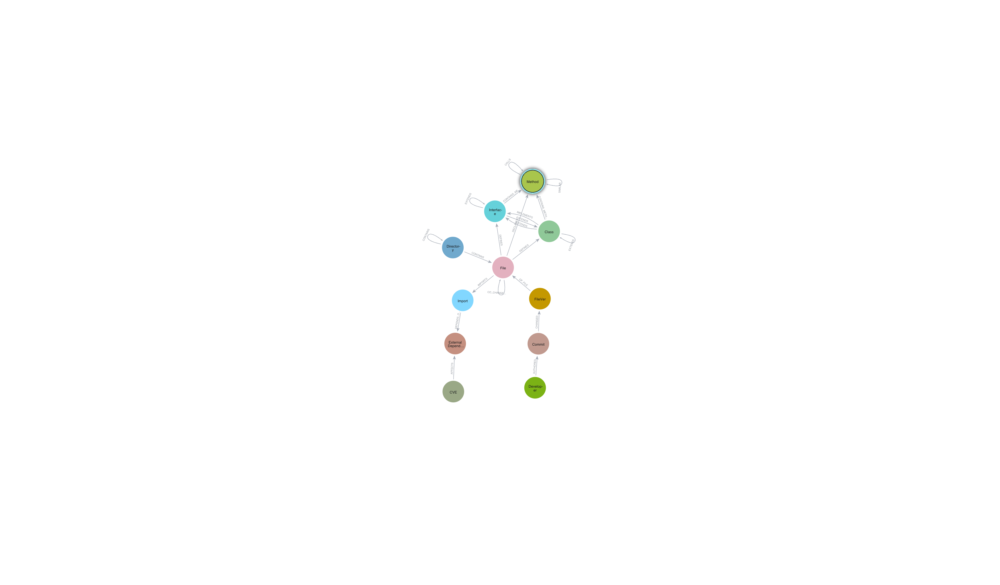

# Neo4j Code Graph

[](https://github.com/alexwoolford/neo4j-code-graph/actions/workflows/ci.yml)
[](https://codecov.io/gh/alexwoolford/neo4j-code-graph)
[](https://www.python.org/downloads/)
[](https://opensource.org/licenses/MIT)
[](https://github.com/alexwoolford/neo4j-code-graph/commits/main)
[](https://github.com/alexwoolford/neo4j-code-graph/issues)
[](https://github.com/alexwoolford/neo4j-code-graph/pulls)

Turn your codebase into a queryable knowledge graph. Find security vulnerabilities, architectural bottlenecks, technical debt hotspots, and team coordination issues with simple Cypher queries.

## Business Queries - What Can You Find?

### 🚨 Security & Risk

**"Which customer-facing APIs use vulnerable dependencies?"**
```cypher
MATCH (cve:CVE)-[:AFFECTS]->(dep:ExternalDependency)<-[:DEPENDS_ON]-(i:Import)<-[:IMPORTS]-(f:File)
MATCH (f)-[:DECLARES]->(m:Method)
WHERE m.is_public = true AND cve.cvss_score >= 7.0
RETURN f.path, m.class_name, m.name, cve.id, cve.cvss_score
ORDER BY cve.cvss_score DESC
```

**"What's our complete dependency risk?"**
```cypher
MATCH (dep:ExternalDependency)
OPTIONAL MATCH (dep)<-[:AFFECTS]-(cve:CVE)
OPTIONAL MATCH (dep)<-[:DEPENDS_ON]-(i:Import)<-[:IMPORTS]-(f:File)
RETURN dep.package, dep.version,
       count(DISTINCT cve) as vulnerabilities,
       count(DISTINCT f) as files_using_it,
       max(cve.cvss_score) as worst_cvss_score
ORDER BY vulnerabilities DESC, files_using_it DESC
```

### 🏗️ Architecture & Technical Debt

**"What code should we refactor first?"**
```cypher
MATCH (f:File)
WHERE f.total_lines > 500 AND f.method_count > 20
OPTIONAL MATCH (f)-[:IMPORTS]->(i:Import)-[:DEPENDS_ON]->(dep:ExternalDependency)<-[:AFFECTS]-(cve:CVE)
WHERE cve.cvss_score >= 7.0
RETURN f.path, f.total_lines, f.method_count, f.class_count,
       count(DISTINCT cve) as security_issues,
       (f.total_lines * f.method_count + count(cve)*100) as priority_score
ORDER BY priority_score DESC
LIMIT 25
```

**"Which methods are architectural bottlenecks?"**
```cypher
MATCH (m:Method)
WHERE m.pagerank_score IS NOT NULL AND m.pagerank_score > 0.001
MATCH (m)<-[:DECLARES]-(f:File)
RETURN f.path, m.class_name, m.name,
       m.pagerank_score as importance,
       m.estimated_lines as complexity
ORDER BY m.pagerank_score DESC
LIMIT 20
```

### 👥 Team & Process

**"Who are the experts for this module?"**
```cypher
MATCH (dev:Developer)-[:AUTHORED]->(commit:Commit)-[:CHANGED]->(fv:FileVer)-[:OF_FILE]->(f:File)
WHERE f.path CONTAINS "pregel" // Change to your module
WITH dev, f, count(DISTINCT commit) as commits_to_file
WHERE commits_to_file >= 3
RETURN dev.name, dev.email,
       count(DISTINCT f) as files_touched,
       sum(commits_to_file) as total_commits
ORDER BY total_commits DESC
LIMIT 10
```

**"Which files always change together?"**
```cypher
MATCH (f1:File)-[cc:CO_CHANGED]->(f2:File)
WHERE cc.support > 5 AND cc.confidence > 0.6
RETURN f1.path, f2.path, cc.support, cc.confidence
ORDER BY cc.confidence DESC
LIMIT 25
```

### 📊 Executive Reporting

**"Technical health summary"**
```cypher
MATCH (f:File)
OPTIONAL MATCH (f)-[:DECLARES]->(m:Method)
WITH count(DISTINCT f) as total_files,
     sum(f.total_lines) as total_lines_of_code,
     count(DISTINCT m) as total_methods,
     sum(CASE WHEN m.estimated_lines > 100 THEN 1 ELSE 0 END) as complex_methods

OPTIONAL MATCH (cve:CVE)
WHERE cve.cvss_score >= 7.0

RETURN total_files, total_lines_of_code, total_methods, complex_methods,
       count(DISTINCT cve) as high_severity_vulnerabilities,
       round(100 - (complex_methods * 100.0 / total_methods)) as maintainability_score
```

**"Release risk assessment"**
```cypher
MATCH (f:File)<-[:OF_FILE]-(fv:FileVer)<-[:CHANGED]-(c:Commit)
WHERE c.date > datetime() - duration('P7D')
WITH f, count(c) as recent_changes
WHERE recent_changes > 0
OPTIONAL MATCH (f)-[:IMPORTS]->(i:Import)-[:DEPENDS_ON]->(dep:ExternalDependency)<-[:AFFECTS]-(cve:CVE)
WHERE cve.cvss_score >= 7.0
OPTIONAL MATCH (f)-[:DECLARES]->(m:Method {is_public: true})
RETURN f.path, recent_changes,
       count(DISTINCT cve) as security_risks,
       count(DISTINCT m) as public_api_methods,
       CASE
         WHEN count(DISTINCT cve) > 0 AND count(DISTINCT m) > 0 THEN "HIGH RISK"
         WHEN count(DISTINCT cve) > 0 OR recent_changes > 10 THEN "MEDIUM RISK"
         ELSE "LOW RISK"
       END as release_risk_level
ORDER BY recent_changes DESC
```

## Quick Start

### 1. Setup
```bash
git clone https://github.com/alexwoolford/neo4j-code-graph
cd neo4j-code-graph
pip install -r requirements.txt

# Set up Neo4j connection
export NEO4J_URI="bolt://localhost:7687"
export NEO4J_USERNAME="neo4j"
export NEO4J_PASSWORD="your_password"
```

### 2. Analyze Your Codebase
```bash
# Run complete analysis pipeline
./scripts/run_pipeline.sh https://github.com/your-org/your-reposh

# Or run individual components
python scripts/code_to_graph.py /path/to/local/repo
python scripts/git_history_to_graph.py /path/to/local/repo
python scripts/cve_analysis.py
```

### 3. Query Your Data
Open Neo4j Browser or Bloom and run the business queries above. Copy/paste any query and modify for your needs.

## What Gets Analyzed

**Code Structure:**
- Files, directories, classes, interfaces, methods
- Inheritance relationships (extends, implements)
- Method calls and dependencies
- External library usage

**Git History:**
- All commits, authors, and file changes
- Co-change patterns between files
- Developer expertise mapping

**Security:**
- CVE vulnerabilities in dependencies
- Vulnerability impact through the codebase
- Security surface analysis

**Generated Insights:**
- Method importance scores (PageRank)
- Architectural bottlenecks (Betweenness Centrality)
- Code similarity clusters

## Graph Schema

The knowledge graph uses this data model:



## Project Structure

```
neo4j-code-graph/
├── src/                    # Core library code
│   ├── analysis/          # Code and git analysis
│   ├── security/          # CVE vulnerability analysis
│   ├── data/              # Schema and data management
│   └── utils/             # Common utilities
├── scripts/               # CLI tools
│   ├── run_pipeline.sh           # Main pipeline script
│   ├── code_to_graph.py          # Code structure analysis
│   ├── git_history_to_graph.py   # Git history analysis
│   ├── cve_analysis.py           # Security analysis
│   └── centrality_analysis.py    # Graph algorithms
├── cypher_templates_for_bloom.cypher  # Ready-to-use Bloom queries
├── examples/              # Business query examples
└── tests/                 # Test suite
```

## Configuration

Set environment variables or create a `.env` file:
```bash
NEO4J_URI=bolt://localhost:7687
NEO4J_USERNAME=neo4j
NEO4J_PASSWORD=your_password
NEO4J_DATABASE=neo4j

# 🔑 IMPORTANT: NVD API key for CVE analysis (highly recommended)
# Get your free API key: https://nvd.nist.gov/developers/request-an-api-key
NVD_API_KEY=your_nvd_api_key
```

> 💡 **Without an NVD API key**, CVE analysis will be much slower (6 seconds per request vs 50 requests/30 seconds with key). Get your free key at: https://nvd.nist.gov/developers/request-an-api-key

## Requirements

- Python 3.10+
- Neo4j 4.0+ (Community or Enterprise)
- Git (for repository analysis)

## Development

### Contributing

When contributing code, please follow our [Coding Style Guide](CODING_STYLE_GUIDE.md) to maintain consistency across the codebase.

Key guidelines:
- Use helper functions from `utils.common` (logging, Neo4j connections, argument parsing)
- Follow established import patterns
- Maintain consistent error handling
- Run pre-commit checks before submitting

### Testing

```bash
# Run all tests
pytest

# Run with coverage
pytest --cov=src tests/

# Run specific test categories
pytest tests/security/
pytest tests/integration/
```

## License

Licensed under the MIT License.
